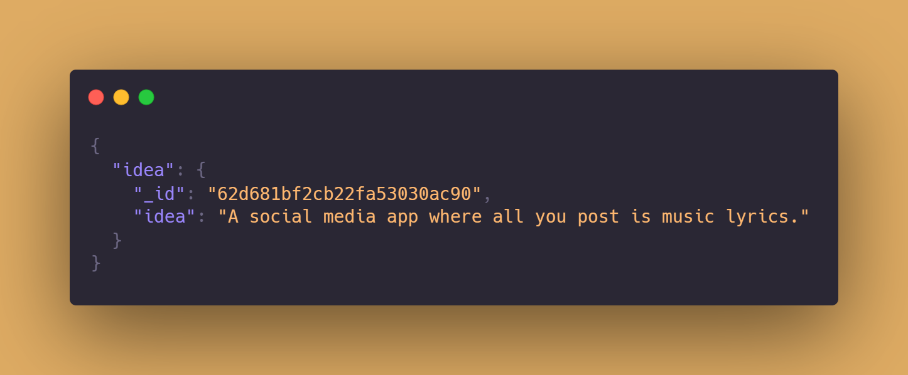

<h1 align="center"> ideas-grab-apis </h1>

<p align="center">
  
</p>

<div align="center">
  


</div>

# API Reference 

## Endpoints
- [Get random idea](#get-random-idea)
- [Get random ideas](#get-random-ideas)
- [Get ideas](#get-ideas)
- [Get search text](#get-search-text)

<br>

## Get random idea

```HTTP
GET /random
```

Returns a single random idea from the database

<br>

**Response**

```js
{
  idea: {
    _id: string,
    idea: string
  }
}
```

<br>

**Example**

Random Idea `>>` [try in browser](https://ideas-grab-api.herokuapp.com/random)

```HTTP
GET /random
```

<br>
<br>

## Get random ideas

```HTTP
GET /random-ideas
```

Returns a list of random ideas from the database

<br>

**Query parameters**

| prams 	|  type 	|              description             	| default 	| max 	|
|:-----:	|:-----:	|:------------------------------------:	|:-------:	|:---:	|
| limit 	| `int` 	| number of ideas returned per request 	|    10   	|  25 	|                                                              

<br>

**Response**

```js
{
  count: number,
  ideas: [
    {
      _id: string,
      idea: string
    },...
  ]
}
```

<br>

**Example**

Random Ideas `>>` [try in browser](https://ideas-grab-api.herokuapp.com/random-ideas)

```HTTP
GET /random-ideas
```

Random Ideas with a limit of 15 ideas `>>` [try in browser](https://ideas-grab-api.herokuapp.com/random-ideas?limit=15)

```HTTP
GET /random-ideas?limit=15
```

<br>
<br>

## Get ideas

```HTTP
GET /ideas
```

Returns a list of all the ideas from the database (_paginated_)

<br>

**Query parameters**

| prams 	|  type 	|            description            	| default 	| max 	|
|:-----:	|:-----:	|:---------------------------------:	|:-------:	|:---:	|
| limit 	| `int` 	| number of ideas returned per page 	|    10   	|  25 	|
|  page 	| `int` 	| page number                       	|    1    	|     	|

<br>

**Response**

```js
{
  metaData: {
    count: number,
    currentPage: number,
    totalPage: number,
    totalCount: number,
    lastItemIndex: number
  },
  ideas: [
    {
      _id: string,
      idea: string
    },...
  ]
}
```

<br>

**Example**

Ideas `>>` [try in browser](https://ideas-grab-api.herokuapp.com/ideas)

```HTTP
GET /ideas
```

Ideas with a limit of 15 ideas on page 2 of 242 pages `>>` [try in browser](https://ideas-grab-api.herokuapp.com/ideas?page=2&limit=15)

```HTTP
GET /ideas?page=2&limit=15
```

<br>
<br>

## Get search text

```HTTP
GET /search
```

Returns a list of all the ideas from the database which includes the search text (_paginated_)

<br>

**Query parameters**

|    prams   	|   type   	|                  description                  	| default 	| max 	|
|:----------:	|:--------:	|:---------------------------------------------:	|:-------:	|:---:	|
|    limit   	|   `int`  	|       number of ideas returned per page       	|    10   	|  25 	|
|    page    	|   `int`  	|                  page number                  	|    1    	|     	|
| searchText 	| `string` 	| includes the ideas which contains search text 	| _phone_ 	|     	|
                                                          
<br>

**Response**

```js
{
  metaData: {
    matchedIdeas: number,
    totalCount: number,
    currentPage: number,
    totalPage: number,
    lastItemIndex: number,
    searchText: string
  },
  ideas: [
    {
      _id: string,
      idea: string
    },...
  ]
}
```

<br>

**Example**

Search `>>` [try in browser](https://ideas-grab-api.herokuapp.com/search)

```HTTP
GET /search
```

Search with a keyword _website_ and limit of 15 ideas on page 2 of 8 pages `>>` [try in browser](https://ideas-grab-api.herokuapp.com/search?searchText=website&page=2&limit=15)

```HTTP
GET /search?searchText=website&page=2&limit=15
```

<br>
<br>
